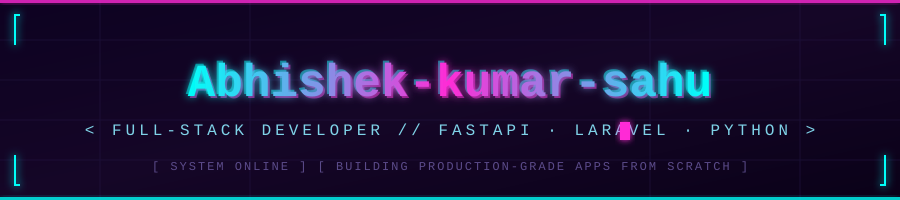

<div align="center">



<br/>


</div>

<br/>

## `> ABOUT.exe`

```yaml
name: Abhishek Kumar Sahu
role: Full-Stack Software Developer
stack:
  backend: [Python, FastAPI, PHP, Laravel]
  focus: production-grade applications, built from scratch
status: always shipping
```

<br/>

## `> PROJECT_LOG`

| 🗂️ Project | ⚙️ Stack | 🔗 Link |
| ---------- | -------- | ------- |
| 🎓 **Student Performance Analysis System** — analyzes and visualizes student academic performance data | `HTML` `CSS` `JS` | [View Repo](https://github.com/Abhishek-kumar-sahu/Student-Performance-Analysis-System) |
| 🔷 **Project Name** — short description goes here | `Tech` `Stack` | [View Repo](#) |
| 🔷 **Project Name** — short description goes here | `Tech` `Stack` | [View Repo](#) |

> 💾 *"Code first, sleep later."*

<br/>

## `> SYSTEM_STATS`

<div align="center">


<br/>


<br/>


<br/>


</div>

<br/>

## `> UPLINK`

<div align="center">

[](mailto:your-email@example.com)
[](https://github.com/Abhishek-kumar-sahu)
[](https://www.linkedin.com/in/abhishek-kumar-sahuu)


</div>

<div align="center">
<sub>⚡ <i>connection stable · always learning · always building</i> ⚡</sub>
</div>
